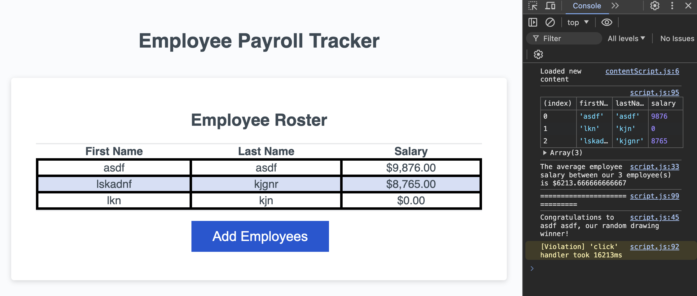
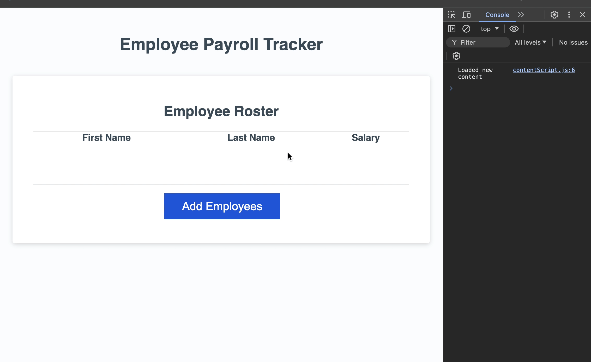

# Employee Payroll Tracker

For this assignment, I created the javascript to allow a user to enter first name, last name, and salaries of employees. After entering the employee information, the console shows the winner of a random drawing and the average salary of all employees entered. 

The following image and movie shows the web application:

## Link to Deployed Version
[Click here to see the deployed version](https://jengelfling.github.io/employee-payroll-tracker/)